# QookiX-Launcher-Android 实现方案文档

> 版本：v1.0-draft
> 日期：2026-09-05
> 状态：待评审

---

# 一、需求与存量功能关系分析

## 1.1 需求功能与存量功能对比

### 1.1.1 已实现功能

**需求功能与 QookiX-Launcher 电脑端存量功能完全匹配的部分：**

| 需求功能 | 存量功能 | 代码位置 | 匹配度 |
|---------|---------|---------|--------|
| 版本清单获取 | `get_version_manifest` | `QookiX-Launcher/src-tauri/src/commands.rs:124` | 100% |
| 版本详情获取 | `get_version_info` | `QookiX-Launcher/src-tauri/src/commands.rs:125` | 100% |
| 离线账号登录 | `login_offline` | `QookiX-Launcher/src-tauri/src/commands.rs:161` | 100% |
| Microsoft 账号登录 | `login_ms_start` / `login_ms_poll` | `QookiX-Launcher/src-tauri/src/commands.rs:162-163` | 100% |
| 账号列表 | `list_accounts` | `QookiX-Launcher/src-tauri/src/commands.rs:160` | 100% |
| 账号登出 | `logout_account` | `QookiX-Launcher/src-tauri/src/commands.rs:164` | 100% |
| 实例列表 | `list_instances` | `QookiX-Launcher/src-tauri/src/commands.rs:127` | 100% |
| 创建实例 | `create_instance` | `QookiX-Launcher/src-tauri/src/commands.rs:129` | 100% |
| 删除实例 | `delete_instance` | `QookiX-Launcher/src-tauri/src/commands.rs:131` | 100% |
| 实例分组 | `list_instance_groups` / `create_instance_group` | `QookiX-Launcher/src-tauri/src/commands.rs:132-134` | 100% |
| 导入整合包 | `import_modpack` | `QookiX-Launcher/src-tauri/src/commands.rs:152` | 100% |
| 游戏启动 | `launch_instance` | `QookiX-Launcher/src-tauri/src/commands.rs:139` | 100% |
| 停止游戏 | `stop_game` | `QookiX-Launcher/src-tauri/src/commands.rs:140` | 100% |
| 游戏状态检测 | `is_game_running` | `QookiX-Launcher/src-tauri/src/commands.rs:141` | 100% |
| Modrinth 浏览 | `browse` / `project_versions` | `QookiX-Launcher/src-tauri/src/commands.rs:166-167` | 100% |
| CurseForge 浏览 | `curseforge_categories` / `project_info` | `QookiX-Launcher/src-tauri/src/commands.rs:168-169` | 100% |
| Mod 安装 | `install_content` | `QookiX-Launcher/src-tauri/src/commands.rs:172` | 100% |
| Mod 卸载 | `uninstall_content` | `QookiX-Launcher/src-tauri/src/commands.rs:175` | 100% |
| 服务器列表 | `list_servers` | `QookiX-Launcher/src-tauri/src/commands.rs:196` | 100% |
| 服务器 Ping | `ping_mc_server` | `QookiX-Launcher/src-tauri/src/commands.rs:197` | 100% |
| 设置管理 | `get_settings` / `set_settings` | `QookiX-Launcher/src-tauri/src/commands.rs:113-114` | 100% |
| 崩溃分析 | `list_crash_logs` / `analyze_crash_log` | `QookiX-Launcher/src-tauri/src/commands.rs:231-232` | 100% |

### 1.1.2 需要扩展的功能

**需求功能与存量功能部分匹配，需要针对安卓平台进行扩展：**

| 需求功能 | 存量功能 | 差异说明 | 扩展方向 |
|---------|---------|---------|---------|
| Java 运行时管理 | `download_java_runtime` (电脑端) | 电脑端下载外部 JRE，安卓端需内置 MultiRT 系统 | 新增 MultiRT 模块，内置 JRE 17/21，支持自动下载 |
| 游戏启动流程 | `launch_game` (电脑端) | 电脑端直接 spawn 进程，安卓端需通过 JNI 启动 Java VM | 重写启动流程，集成 Caciocavallo AWT 模拟 |
| 前台服务 | 无 | 电脑端无此概念，安卓需前台服务保持进程存活 | 新增 GameService (Foreground Service) |
| 存储权限 | 无 | 电脑端直接访问文件系统，安卓需 SAF 权限管理 | 新增 StoragePermissionManager |
| 通知系统 | 系统托盘 | 电脑端用 tray icon，安卓需通知栏 | 新增 NotificationManager |
| 输入处理 | 无 | 电脑端用键盘鼠标，安卓需触摸/手柄输入 | 新增 InputBridge 模块 |
| 控制布局 | 无 | 电脑端无此概念，安卓需自定义控制 | 新增 ControlLayout 系统 |
| 深链接 | `tauri-plugin-deep-link` | 电脑端用 CLI 参数，安卓需 Intent Filter | 重写 deep link 处理逻辑 |

### 1.1.3 需要新增的功能或接口

**需求在存量代码中完全没有对应实现的部分：**

1. **Tauri Plugin 桥接层**
   - `TauriPluginAndroid`：桥接原生 Android 功能到 Tauri
   - `ForegroundServicePlugin`：前台服务管理
   - `StoragePermissionPlugin`：存储权限管理
   - `NotificationPlugin`：通知管理
   - `InputBridgePlugin`：输入桥接

2. **MultiRT 系统**
   - `MultiRTManager`：多 Java 运行时管理
   - `JREInstaller`：JRE 下载与安装
   - `JREValidator`：JRE 兼容性验证

3. **游戏界面模块**
   - `MainActivity`：游戏主界面（GLSurface + 控制布局）
   - `ControlLayout`：自定义控制布局
   - `VirtualTouchpad`：虚拟触摸板
   - `VirtualKeyboard`：虚拟键盘
   - `GyroscopeController`：陀螺仪控制

4. **下载管理模块**
   - `DownloadService`：后台下载服务
   - `DownloadNotificationManager`：下载进度通知

---

## 1.2 存量功能详细分析

### 1.2.1 Rust 后端核心模块分析

**模块职责与接口契约：**

| 模块 | 核心职责 | 关键接口 | 约束条件 |
|------|---------|---------|---------|
| `accounts.rs` | 账号管理（离线 + MS） | `login_offline`, `login_ms_start`, `login_ms_poll` | Token 加密存储，自动刷新 |
| `launch.rs` | 游戏启动与进程管理 | `launch_game`, `kill_game`, `is_running` | 进程生命周期管理，日志流输出 |
| `instances.rs` | 实例管理 CRUD | `list_instances`, `create_instance`, `delete_instance` | 数据一致性，事务边界 |
| `download.rs` | 文件下载 | `get_text`, `get_json` | 断点续传，进度回调 |
| `install.rs` | 游戏安装 | `install_game`, `extract_natives` | 文件校验，原子操作 |
| `java.rs` | Java 运行时检测 | `detect_java`, `download_java_runtime` | 跨平台路径处理 |
| `modrinth.rs` / `curseforge.rs` | 内容 API | `browse`, `project_versions`, `project_info` | API 限流，缓存策略 |
| `settings.rs` | 配置管理 | `load_settings`, `save_settings` | 配置版本兼容 |
| `state.rs` | 全局状态 | `AppState` | 线程安全（RwLock/Mutex） |

**扩展点分析：**

1. **`AppState` 结构**：当前包含 `root`, `settings`, `client`, `semaphore`, `game_pids`, `server_pids` 等字段。安卓端需新增：
   - `notification_manager`：通知管理器
   - `permission_manager`：权限管理器
   - `foreground_service`：前台服务状态

2. **事件系统**：当前使用 `app.emit("launch://progress", ...)` 等事件。安卓端需：
   - 保持事件机制兼容
   - 新增 Android 原生事件桥接

3. **文件路径**：当前使用 `std::path::PathBuf`。安卓端需：
   - 适配 SAF 路径
   - 支持外部存储访问

### 1.2.2 Vue 前端组件分析

**可复用组件清单：**

| 组件 | 复用方式 | 适配说明 |
|------|---------|---------|
| `InstanceCard.vue` | 直接复用 | 数据模型兼容，样式需适配移动端 |
| `ProjectCard.vue` | 直接复用 | 内容中心卡片，样式需适配 |
| `LaunchProgress.vue` | 直接复用 | 启动进度对话框，逻辑兼容 |
| `MsLoginDialog.vue` | 直接复用 | Microsoft 登录对话框，API 兼容 |
| `CrashAnalyzer.vue` | 直接复用 | 崩溃分析组件，数据兼容 |
| `LogViewer.vue` | 直接复用 | 日志查看器，功能兼容 |
| `SideBar.vue` | 需重构 | 电脑端侧边栏 → 安卓底部导航 |
| `ContextMenu.vue` | 需重构 | 电脑端右键菜单 → 安卓长按菜单 |

**可复用 Store：**

| Store | 复用方式 | 适配说明 |
|-------|---------|---------|
| `accounts.ts` | 直接复用 | 数据模型兼容，Token 存储需适配 Android Keystore |
| `version.ts` | 直接复用 | 版本管理逻辑兼容 |
| `theme.ts` | 直接复用 | 主题系统兼容，需适配 Compose 主题 |

---

# 二、增量设计方案

## 2.1 实现模型

### 2.1.1 上下文视图

**系统与外部交互关系：**

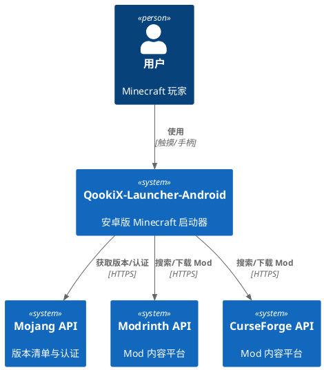

**内部模块交互：**

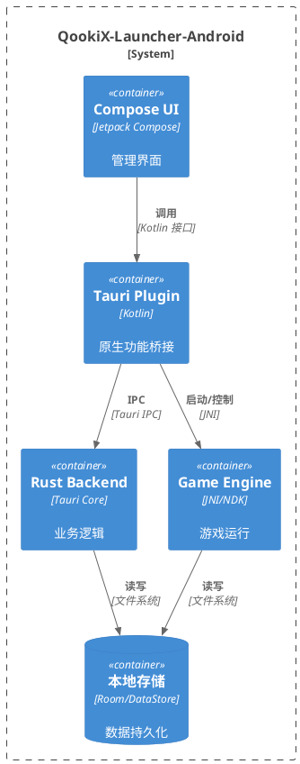

### 2.1.2 服务/组件总体架构

**模块划分与依赖关系：**

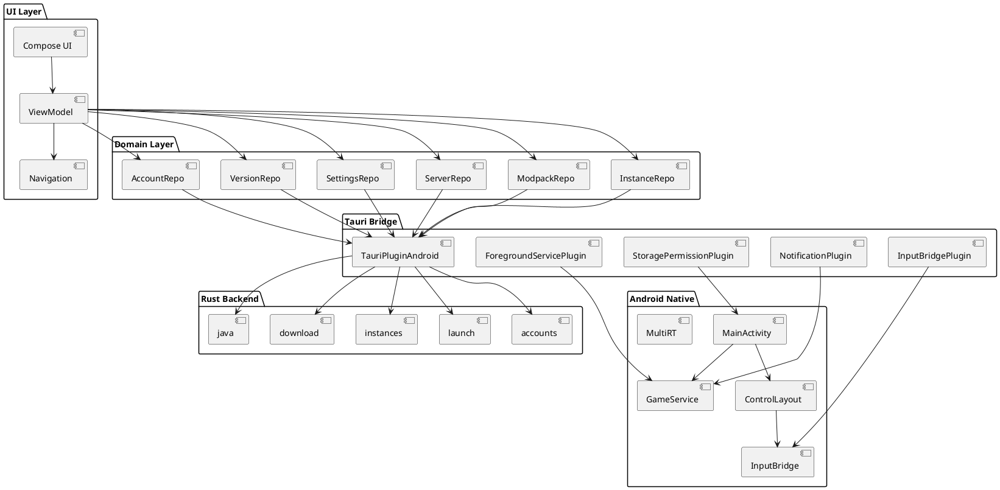

**核心类职责：**

| 类名 | 职责 | 所在模块 |
|------|------|---------|
| `QookixApplication` | 应用入口，初始化依赖注入 | `app` |
| `MainActivity` | 主界面，管理导航与游戏界面切换 | `ui` |
| `GameViewModel` | 游戏启动与状态管理 | `domain` |
| `TauriPluginAndroid` | Tauri 原生插件入口 | `bridge` |
| `MultiRTManager` | 多 Java 运行时管理 | `native` |
| `GameService` | 前台服务，保持游戏进程存活 | `service` |
| `ControlLayout` | 自定义控制布局 | `input` |
| `AWTInputBridge` | 输入事件桥接（复用 Pojav） | `input` |

### 2.1.3 实现设计文档

**游戏启动状态机：**

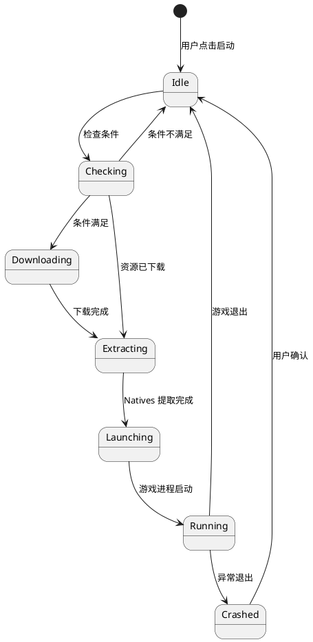

**下载流程设计：**

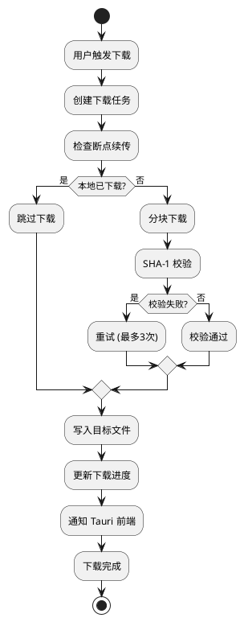

**输入处理流程：**

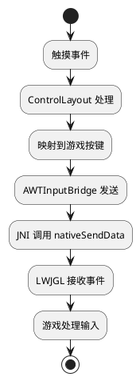

---

## 2.2 接口设计

### 2.2.1 总体设计

**接口分类：**

| 分类 | 接口数量 | 说明 |
|------|---------|------|
| Tauri Commands | 50+ | 与 Rust 后端通信 |
| Plugin API | 15 | 原生 Android 功能 |
| Event System | 10 | 双向事件通信 |
| JNI Bridge | 20 | Java 与 Native 通信 |

**接口版本策略：**
- 所有 Tauri Commands 保持与电脑端兼容
- Plugin API 使用语义化版本（v1.0.0）
- 事件名称使用 `namespace://event` 格式

### 2.2.2 接口清单

#### Tauri Commands（复用电脑端）

```typescript
// 版本管理
getVersionManifest(): Promise<VersionList>
getVersionInfo(versionId: string): Promise<VersionInfo>

// 账号管理
listAccounts(): Promise<Account[]>
loginOffline(username: string): Promise<Account>
loginMsStart(): Promise<DeviceCodeResponse>
loginMsPoll(deviceCode: string): Promise<MicrosoftAccount>
logoutAccount(accountId: string): Promise<void>

// 实例管理
listInstances(): Promise<MinecraftProfile[]>
createInstance(config: InstanceConfig): Promise<MinecraftProfile>
deleteInstance(instanceId: string): Promise<void>
importModpack(filePath: string): Promise<void>

// 游戏启动
launchInstance(instanceId: string, server?: string): Promise<LaunchResult>
stopGame(): Promise<void>
isGameRunning(instanceId: string): Promise<boolean>

// 内容管理
browse(platform: string, query: string): Promise<Project[]>
installContent(instanceId: string, projectId: string): Promise<void>
```

#### Plugin API（安卓原生）

```kotlin
// 前台服务接口
interface ForegroundServicePlugin {
    fun startGameService(instanceId: String, notificationId: Int)
    fun stopGameService()
    fun updateProgress(progress: Int, message: String)
}

// 存储权限接口
interface StoragePermissionPlugin {
    fun requestStoragePermission(): PermissionResult
    fun openDirectoryPicker(): Uri?
    fun getRealPathFromUri(uri: Uri): String?
}

// 通知接口
interface NotificationPlugin {
    fun showDownloadProgress(title: String, progress: Int, max: Int)
    fun showGameControls(instanceId: String)
    fun cancelNotification(id: Int)
}

// 输入桥接接口
interface InputBridgePlugin {
    fun sendKeyEvent(keyCode: Int, action: Int)
    fun sendMouseEvent(x: Int, y: Int, button: Int, action: Int)
    fun sendCharEvent(char: Char)
    fun setControlLayout(layout: ControlLayout)
}
```

#### 事件系统

```typescript
// 从 Rust 到前端
interface LaunchEvents {
    'launch://progress': { step: string; progress: number }
    'launch://log': { instanceId: string; stream: 'out' | 'err'; line: string }
    'launch://state': { instanceId: string; state: 'running' | 'exited'; pid: number }
    'launch://crash': { instanceId: string; diag: CrashDiag }
    'download://progress': { taskId: string; progress: number; speed: number }
}

// 从前端到原生
interface PluginEvents {
    'permission://request': { permission: string }
    'notification://action': { action: string; notificationId: number }
    'input://layout': { layout: ControlLayout }
}
```

---

## 2.3 数据模型

### 2.3.1 设计目标

**与电脑端兼容的数据结构：**

1. **实例配置**：保持 `launcher_profiles.json` 格式兼容
2. **账号数据**：保持 `accounts.json` 格式兼容
3. **版本信息**：保持 `version_manifest_v2.json` 格式兼容
4. **设置数据**：保持 `settings.json` 格式兼容

**存储方案：**

| 数据类型 | 存储方式 | 说明 |
|---------|---------|------|
| 实例配置 | JSON 文件 | 兼容电脑端格式 |
| 账号数据 | JSON 文件 + Android Keystore | Token 加密存储 |
| 设置数据 | DataStore | 类型安全，异步 |
| 控制布局 | JSON 文件 | 用户可编辑 |
| 缓存数据 | 文件系统 | 版本列表、图标等 |

### 2.3.2 模型实现

**核心领域对象：**

```kotlin
// 实例配置（与电脑端兼容）
data class MinecraftProfile(
    val id: String,
    val name: String,
    val mcVersion: String,
    val loader: Loader,
    val loaderVersion: String?,
    val created: Long,
    val lastPlayed: Long?,
    val totalPlayTime: Long,
    val gameDir: String,
    val javaDir: String,  // amethyst://Internal-17
    val javaArgs: String?,
    val gameArgs: String?,
    val resolution: Pair<Int, Int>?,
    val maxMemoryMb: Int?,
    val memoryMode: String?,
    val accountId: String?,
    val icon: String?,
    val mods: List<InstalledContent>,
    val resourcePacks: List<InstalledContent>,
    val shaders: List<InstalledContent>,
    val group: String?,
    val isSymlink: Boolean?,
    val sourcePath: String?
)

// 账号（密封接口，支持离线 + Microsoft）
sealed interface Account {
    data class Offline(
        val uuid: String,
        val username: String,
        val created: Long
    ) : Account

    data class Microsoft(
        val uuid: String,
        val username: String,
        val created: Long,
        val msaRefreshToken: String,  // 加密存储
        val xuid: String,
        val expiresAt: Long,
        val skinFaceBase64: String?
    ) : Account
}

// Java 运行时
data class Runtime(
    val name: String,        // "Internal-17"
    val versionString: String,
    val javaVersion: Int,    // 17
    val arch: String,        // "arm64"
    val path: String,
    val isInternal: Boolean
)

// 控制布局
data class ControlLayout(
    val id: String,
    val name: String,
    val elements: List<ControlElement>,
    val isDefault: Boolean
)

sealed interface ControlElement {
    data class Button(
        val id: String,
        val label: String,
        val keyCode: Int,
        val x: Float,
        val y: Float,
        val width: Float,
        val height: Float
    ) : ControlElement

    data class Joystick(
        val id: String,
        val x: Float,
        val y: Float,
        val radius: Float
    ) : ControlElement

    data class Touchpad(
        val id: String,
        val x: Float,
        val y: Float,
        val width: Float,
        val height: Float
    ) : ControlElement
}
```

---

## 2.4 关键流程设计

### 2.4.1 游戏启动流程

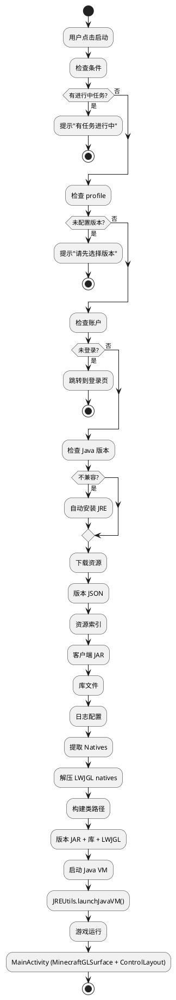

### 2.4.2 下载流程

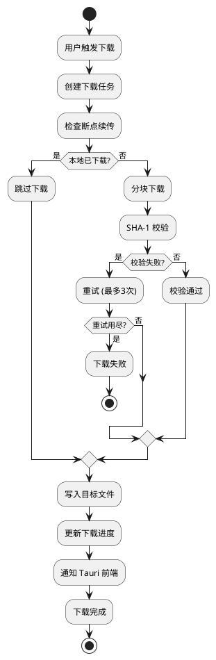

### 2.4.3 输入处理流程


---

## 2.5 UI 组件设计

### 2.5.1 复用组件清单

**从电脑端 Vue 前端复用的组件：**

| 组件 | 复用方式 | 适配说明 |
|------|---------|---------|
| `InstanceCard` | 直接复用 | 数据模型兼容，样式需适配移动端 |
| `ProjectCard` | 直接复用 | 内容中心卡片，样式需适配 |
| `LaunchProgress` | 直接复用 | 启动进度对话框，逻辑兼容 |
| `MsLoginDialog` | 直接复用 | Microsoft 登录对话框，API 兼容 |
| `CrashAnalyzer` | 直接复用 | 崩溃分析组件，数据兼容 |
| `LogViewer` | 直接复用 | 日志查看器，功能兼容 |
| `AccountChip` | 直接复用 | 账号显示组件，样式适配 |
| `AppIcon` | 直接复用 | 应用图标组件，兼容 |

### 2.5.2 原生组件清单

**安卓原生组件：**

| 组件 | 类型 | 说明 |
|------|------|------|
| `HomeView` | Compose | 首页，欢迎信息、最近游玩 |
| `InstanceListView` | Compose | 实例列表，卡片式展示 |
| `InstanceDetailView` | Compose | 实例详情，Mod 管理 |
| `CreateInstanceView` | Compose | 创建实例向导 |
| `BrowseView` | Compose | 内容中心，Mod/资源包浏览 |
| `DownloadsView` | Compose | 下载中心，进行中任务 |
| `MultiplayerView` | Compose | 多人游戏，服务器列表 |
| `SettingsView` | Compose | 设置页面 |
| `SkinsView` | Compose | 皮肤中心 |
| `LoginView` | Compose | 登录页面 |
| `MainActivity` | Activity | 游戏主界面 |
| `ControlLayoutView` | Compose | 控制布局编辑 |
| `MinecraftGLSurface` | SurfaceView | 游戏渲染表面 |

### 2.5.3 组件交互设计

**底部导航布局：**

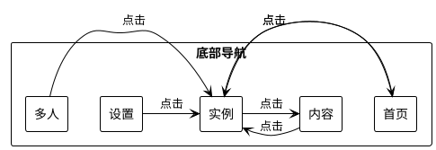

**游戏界面布局：**

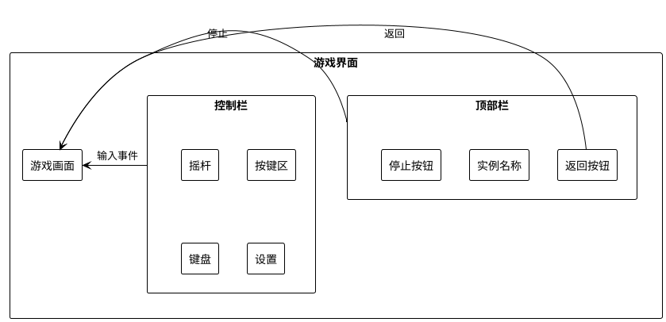

---

## 2.6 安全设计

### 2.6.1 权限控制

**权限矩阵：**

| 权限 | 级别 | 用途 | 申请时机 |
|------|------|------|---------|
| `READ_EXTERNAL_STORAGE` | 危险 | 读取游戏目录 | 首次访问 |
| `WRITE_EXTERNAL_STORAGE` | 危险 | 写入游戏目录 | 首次访问 |
| `POST_NOTIFICATIONS` | 危险 | 显示通知 | 游戏启动时 |
| `FOREGROUND_SERVICE` | 正常 | 前台服务 | 游戏运行时 |
| `INTERNET` | 正常 | 网络访问 | 应用启动 |
| `ACCESS_NETWORK_STATE` | 正常 | 网络状态 | 应用启动 |

**权限申请流程：**

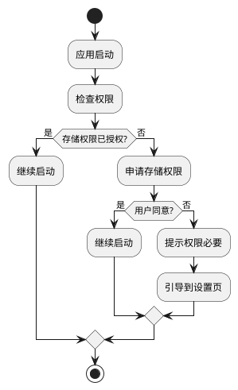

### 2.6.2 数据加密

**加密策略：**

| 数据类型 | 加密方式 | 存储位置 |
|---------|---------|---------|
| Microsoft Token | Android Keystore (AES-256) | EncryptedSharedPreferences |
| 账号密码 | 不存储 | - |
| 游戏配置 | 不加密 | JSON 文件 |
| 控制布局 | 不加密 | JSON 文件 |
| 下载文件 | SHA-1 校验 | 本地文件 |

**Token 加密存储实现：**

```kotlin
// 使用 Android Keystore 加密 Token
class SecureTokenStorage(context: Context) {
    private val sharedPreferences = EncryptedSharedPreferences.create(
        "token_prefs",
        MasterKey.Builder(context)
            .setKeyScheme(MasterKey.KeyScheme.AES256_GCM)
            .build(),
        context,
        EncryptedSharedPreferences.PrefKeyEncryptionScheme.AES256_SIV,
        EncryptedSharedPreferences.PrefValueEncryptionScheme.AES256_GCM
    )
    
    fun saveRefreshToken(refreshToken: String) {
        sharedPreferences.edit().putString("ms_refresh_token", refreshToken).apply()
    }
    
    fun getRefreshToken(): String? {
        return sharedPreferences.getString("ms_refresh_token", null)
    }
}
```

### 2.6.3 网络安全

**网络安全配置：**

```xml
<!-- res/xml/network_security_config.xml -->
<?xml version="1.0" encoding="utf-8"?>
<network-security-config>
    <domain-config cleartextTrafficPermitted="false">
        <domain includeSubdomains="true">mojang.com</domain>
        <domain includeSubdomains="true">minecraft.net</domain>
        <domain includeSubdomains="true">modrinth.com</domain>
        <domain includeSubdomains="true">curseforge.com</domain>
    </domain-config>
    <debug-overrides>
        <trust-anchors>
            <certificates src="user" />
        </trust-anchors>
    </debug-overrides>
</network-security-config>
```

**证书校验：**
- 所有 HTTPS 请求强制证书校验
- 禁止使用自定义 TrustManager
- 证书锁定（Certificate Pinning）可选

---

## 2.7 性能优化设计

### 2.7.1 启动优化

**启动阶段划分：**

| 阶段 | 目标时间 | 优化措施 |
|------|---------|---------|
| Application 创建 | ≤ 500ms | 延迟初始化非关键组件 |
| MainActivity 创建 | ≤ 1s | 异步加载 Tauri |
| 首屏渲染 | ≤ 1.5s | 预加载关键数据 |
| 完全可用 | ≤ 3s | 懒加载非关键页面 |

**优化措施：**

```kotlin
// 延迟初始化
class QookixApplication : Application() {
    override fun onCreate() {
        super.onCreate()
        
        // 必须初始化
        Hilt.init(this)
        
        // 延迟初始化
        CoroutineScope(Dispatchers.IO).launch {
            delay(500)  // 延迟 500ms 初始化
            initializeTauri()
            preloadVersionList()
        }
    }
}
```

### 2.7.2 内存优化

**内存管理策略：**

| 策略 | 说明 |
|------|------|
| 图片加载优化 | Coil 默认内存缓存，禁用磁盘缓存 |
| 列表分页 | 实例列表分页加载，每页 20 条 |
| 资源释放 | 游戏退出时释放所有资源 |
| 内存监控 | 监控内存使用，超过阈值告警 |

**内存预算：**

| 组件 | 内存预算 |
|------|---------|
| 启动器本身 | ≤ 100MB |
| 游戏运行时 | 用户配置 |
| 缓存 | ≤ 50MB |

### 2.7.3 渲染优化

**游戏渲染优化：**

| 优化项 | 说明 |
|------|------|
| 帧率限制 | 默认 60fps，可配置 |
| 分辨率缩放 | 支持 0.5x-2x 缩放 |
| 渲染器选择 | OpenGL ES 2/3、Vulkan、Zink |
| 帧缓冲 | 双缓冲，避免撕裂 |

---

## 2.8 开发计划

### 2.8.1 分阶段开发任务

**Phase 1: 基础框架（4 周）**

| 周期 | 任务 | 交付物 | 依赖 |
|------|------|--------|------|
| W1 | 项目初始化、技术栈搭建 | 可运行的空项目 | 无 |
| W1 | 基础 UI 框架（底部导航、主题系统） | 导航框架 | 无 |
| W2 | MultiRT 集成（JRE 17/21 内置） | Java 运行时管理 | 无 |
| W2 | 版本清单获取与展示 | 版本列表页面 | 无 |
| W3 | 账号管理（离线 + Microsoft） | 登录页面 | 无 |
| W3 | 实例管理 CRUD | 实例列表/详情页面 | 无 |
| W4 | 游戏启动流程（下载 + 启动） | 可启动游戏 | 前序任务 |

**Phase 2: 内容生态（4 周）**

| 周期 | 任务 | 交付物 | 依赖 |
|------|------|--------|------|
| W5 | Modrinth API 集成 | Mod 浏览页面 | Phase 1 |
| W6 | CurseForge API 集成 | 内容中心完整 | Phase 1 |
| W7 | Mod 安装与管理 | 实例 Mod 列表 | Phase 2 W5-6 |
| W7 | 整合包导入（.mrpack） | 导入功能 | Phase 1 |
| W8 | 资源包/着色器管理 | 内容管理完整 | Phase 2 W5-6 |

**Phase 3: 安卓特化（3 周）**

| 周期 | 任务 | 交付物 | 依赖 |
|------|------|--------|------|
| W9 | 自定义控制布局 | 控制编辑器 | Phase 1 |
| W10 | 虚拟触摸板 + 键盘 | 输入系统 | Phase 3 W9 |
| W10 | 陀螺仪 + 手柄支持 | 高级输入 | Phase 3 W9 |
| W11 | 前台服务 + 通知 | 后台运行 | Phase 1 |

**Phase 4: 完善与优化（3 周）**

| 周期 | 任务 | 交付物 | 依赖 |
|------|------|--------|------|
| W12 | 多人游戏（服务器列表 + Ping） | 多人游戏页面 | Phase 1 |
| W13 | 皮肤管理 | 皮肤中心 | Phase 1 |
| W13 | 崩溃分析 | 崩溃报告 | Phase 1 |
| W14 | 性能优化、兼容性测试 | 发布候选版 | 全部 |

### 2.8.2 依赖关系

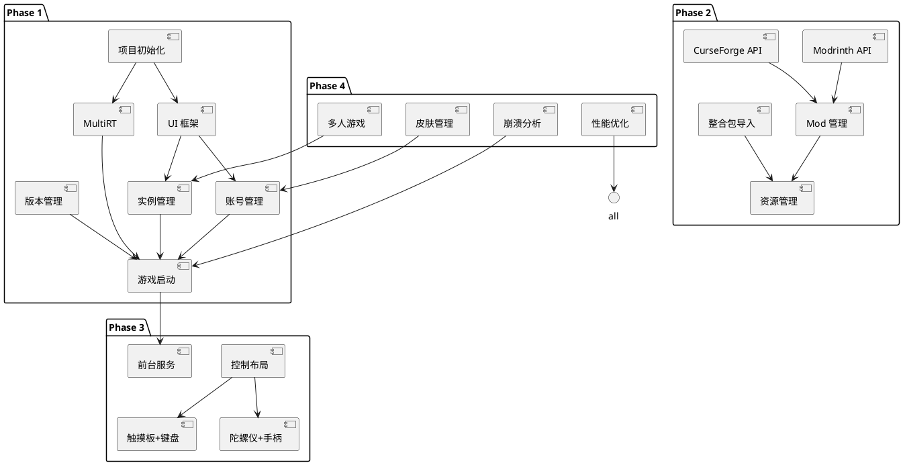

### 2.8.3 风险点与应对

| 风险 | 概率 | 影响 | 应对措施 |
|------|------|------|---------|
| Java 运行时兼容性问题 | 中 | 高 | 充分测试，提供多种 JRE 选项 |
| OpenGL ES 渲染问题 | 高 | 高 | 参考 Pojav 实现，支持多渲染器 |
| 存储权限问题 | 中 | 中 | SAF 方案，引导用户授权 |
| 网络访问限制 | 低 | 中 | 提供镜像源配置 |
| 性能问题 | 中 | 中 | 性能监控，持续优化 |
| 游戏版本更新 | 高 | 低 | 版本兼容设计，及时更新 |

---

## 附录

### A. 项目目录结构

```
QookiX-Launcher-Android/
├── app/
│   ├── src/main/
│   │   ├── java/com/qookix/launcher/
│   │   │   ├── QookixApplication.kt
│   │   │   ├── MainActivity.kt
│   │   │   ├── GameActivity.kt
│   │   │   ├── di/
│   │   │   │   └── AppModule.kt
│   │   │   ├── ui/
│   │   │   │   ├── component/
│   │   │   │   │   ├── InstanceCard.kt
│   │   │   │   │   ├── ProjectCard.kt
│   │   │   │   │   └── ControlLayoutEditor.kt
│   │   │   │   ├── screen/
│   │   │   │   │   ├── HomeScreen.kt
│   │   │   │   │   ├── InstancesScreen.kt
│   │   │   │   │   ├── BrowseScreen.kt
│   │   │   │   │   ├── SettingsScreen.kt
│   │   │   │   │   └── MultiplayerScreen.kt
│   │   │   │   └── theme/
│   │   │   │       ├── Color.kt
│   │   │   │       ├── Type.kt
│   │   │   │       └── Theme.kt
│   │   │   ├── viewmodel/
│   │   │   │   ├── GameViewModel.kt
│   │   │   │   ├── InstancesViewModel.kt
│   │   │   │   └── SettingsViewModel.kt
│   │   │   ├── domain/
│   │   │   │   ├── repository/
│   │   │   │   │   ├── VersionRepository.kt
│   │   │   │   │   ├── AccountRepository.kt
│   │   │   │   │   └── InstanceRepository.kt
│   │   │   │   └── model/
│   │   │   │       ├── MinecraftProfile.kt
│   │   │   │       ├── Account.kt
│   │   │   │       └── ControlLayout.kt
│   │   │   ├── bridge/
│   │   │   │   ├── TauriPluginAndroid.kt
│   │   │   │   ├── ForegroundServicePlugin.kt
│   │   │   │   ├── StoragePermissionPlugin.kt
│   │   │   │   ├── NotificationPlugin.kt
│   │   │   │   └── InputBridgePlugin.kt
│   │   │   ├── service/
│   │   │   │   ├── GameService.kt
│   │   │   │   └── DownloadService.kt
│   │   │   ├── input/
│   │   │   │   ├── ControlLayout.kt
│   │   │   │   ├── AWTInputBridge.kt
│   │   │   │   ├── VirtualTouchpad.kt
│   │   │   │   └── VirtualKeyboard.kt
│   │   │   ├── runtime/
│   │   │   │   ├── MultiRTManager.kt
│   │   │   │   ├── JREInstaller.kt
│   │   │   │   └── JREValidator.kt
│   │   │   └── util/
│   │   │       ├── Extensions.kt
│   │   │       └── FileUtils.kt
│   │   ├── assets/
│   │   │   ├── tauri/
│   │   │   │   └── index.html
│   │   │   └── js/
│   │   └── res/
│   │       ├── values/
│   │       ├── layout/
│   │       └── xml/
│   ├── build.gradle.kts
│   └── proguard-rules.pro
├── src-tauri/
│   ├── Cargo.toml
│   └── src/
│       ├── lib.rs
│       ├── main.rs
│       ├── accounts.rs
│       ├── launch.rs
│       ├── instances.rs
│       ├── download.rs
│       ├── install.rs
│       ├── java.rs
│       ├── modrinth.rs
│       ├── curseforge.rs
│       ├── settings.rs
│       ├── state.rs
│       └── ...
├── docs/
│   ├── requirements.md
│   └── design.md
├── gradle/
├── build.gradle.kts
├── settings.gradle.kts
└── README.md
```

### B. 技术栈版本

| 组件 | 版本 | 说明 |
|------|------|------|
| Kotlin | 1.9+ | 安卓官方首选语言 |
| Compose | 1.6+ | 现代声明式 UI |
| Navigation Compose | 1.6+ | 类型安全路由 |
| Hilt | 2.50+ | 依赖注入 |
| Retrofit | 2.9+ | HTTP 客户端 |
| Kotlinx Serialization | 1.6+ | JSON 序列化 |
| Coil | 2.5+ | 图片加载 |
| DataStore | 1.1+ | 数据存储 |
| Tauri 2 | 2.x | 跨平台框架 |
| Rust | 1.75+ | 后端语言 |
| Gradle | 9.x | 构建系统 |
| AGP | 9.x | 安卓构建插件 |

### C. 参考项目

1. **QookiX-Launcher 电脑端**
   - 路径：`I:\program\vibe\mc\QookiX-Launcher`
   - 复用：Rust 后端、Vue 前端、数据模型

2. **Amethyst-Android**
   - 路径：`I:\program\vibe\mc\Amethyst-Android`
   - 参考：MultiRT 系统、游戏启动流程、输入处理

3. **PojavLauncher**
   - 路径：`I:\program\vibe\mc\PojavLauncher`
   - 参考：OpenJDK 集成、OpenGL 渲染、AWT 模拟
